# 🌐 익명 커뮤니티 게시판 (Team 꽉Java)

## 📖 프로젝트 소개
직장인들의 자유로운 소통을 위한 **익명 기반 커뮤니티 플랫폼**입니다.  
사용자는 익명으로 글과 댓글을 작성하고, 쪽지, 북마크, 좋아요 기능을 활용할 수 있습니다.  
관리자는 별도의 페이지에서 회원, 게시글, 댓글을 통합 관리하며 통계 대시보드도 확인할 수 있습니다.  

- 📅 프로젝트 기간: 2025.08.20 ~ 2025.09.03  
- 👥 개발 인원: 5명 (이다겸, 윤호준, 최수인, 김근수, 권영승)  

---

## 🚀 개발 목적
- 직장인들의 자유로운 소통 공간 부재 문제 해결  
- 익명성 보장을 통해 위계와 부담을 줄이고 진솔한 의견 교환 가능  
- 관리자 권한으로 운영 건전성을 확보  
- 실제 서비스 수준의 데이터베이스와 UI/UX 경험 제공  

---

## ⚙️ 기술 스택
| 영역 | 기술 |
|------|------|
| Frontend | HTML, CSS, JavaScript (Vanilla) |
| Backend | Spring Boot (Java 17) |
| Database | Oracle |
| ORM/Mapper | MyBatis |
| Infra | Local 환경 (Oracle + Spring Boot), Public Cloud 활용 |
| 협업 | GitHub, Notion, KakaoTalk |

---

## 🗂️ ERD (Database Schema)
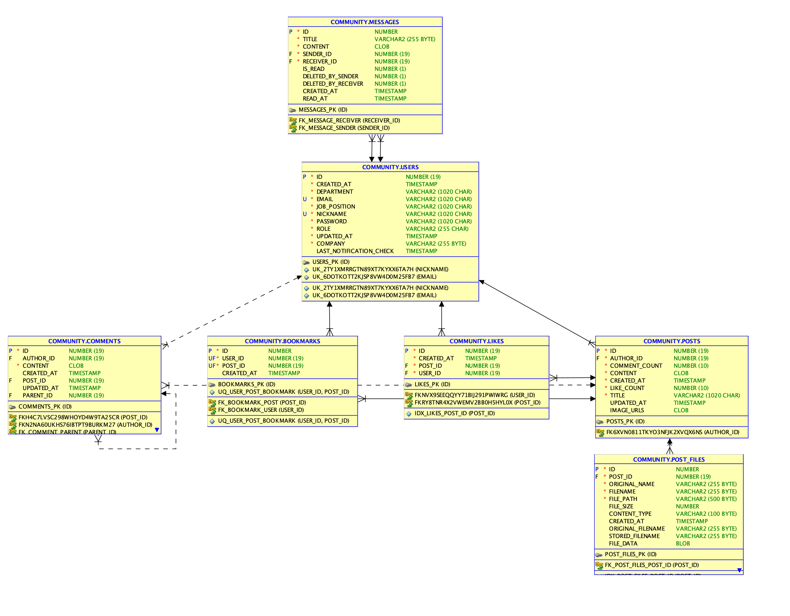

---

## 💻 화면 설계 (UI)

### 로그인 & 회원가입
| 로그인 | 회원가입 |
|--------|-----------|
| 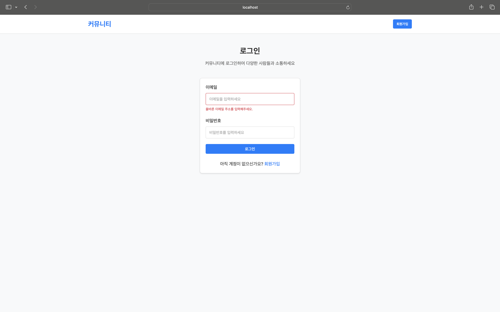 | 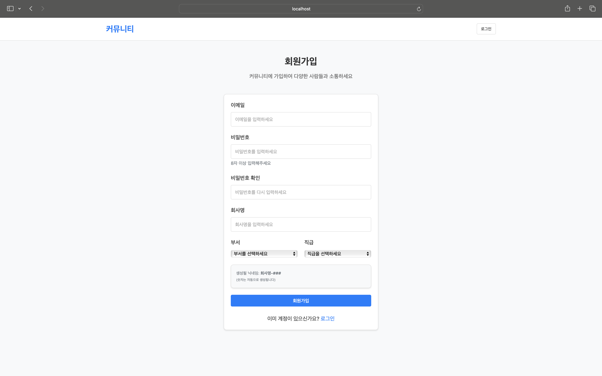 |

### 게시판
| 글 목록 | 글 작성 | 글 상세 |
|---------|---------|---------|
| 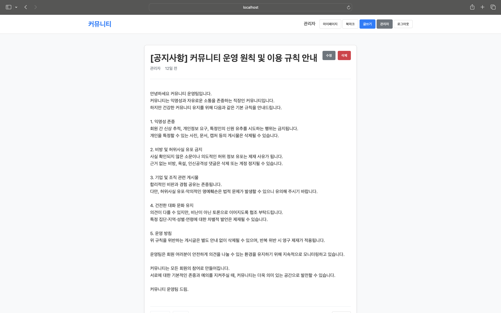 | 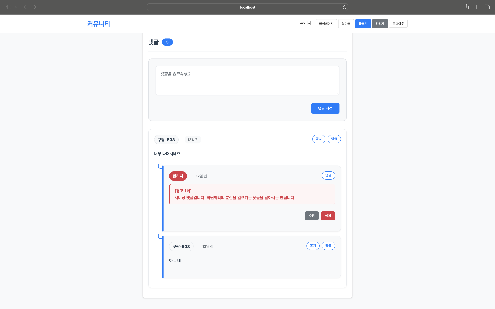 | 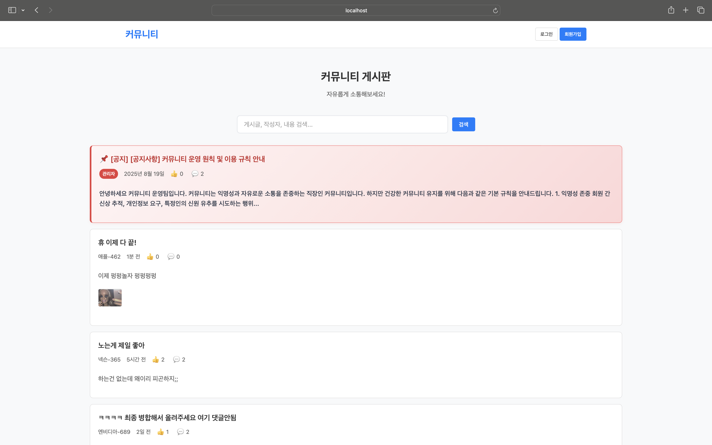 |

### 마이페이지 & 쪽지
| 마이페이지 메인 | 내가 쓴 글 | 받은 쪽지 |
|----------------|------------|------------|
| 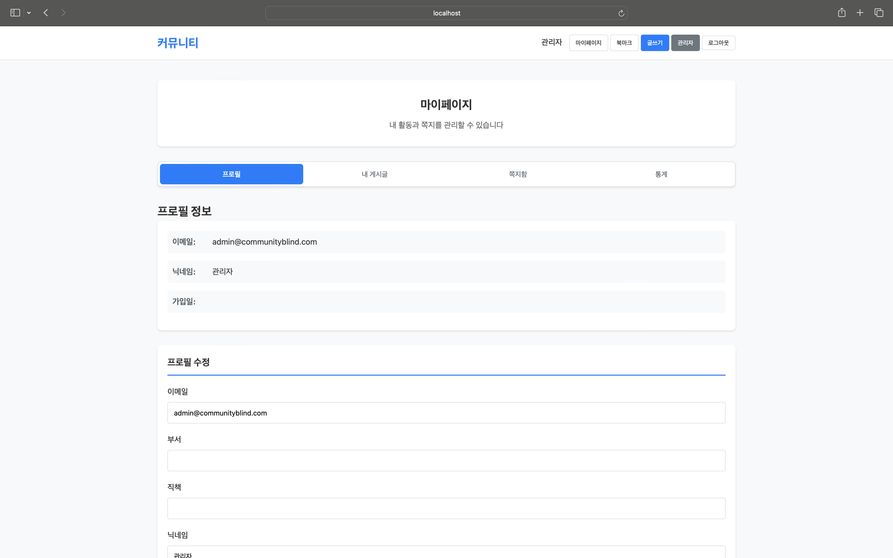 | 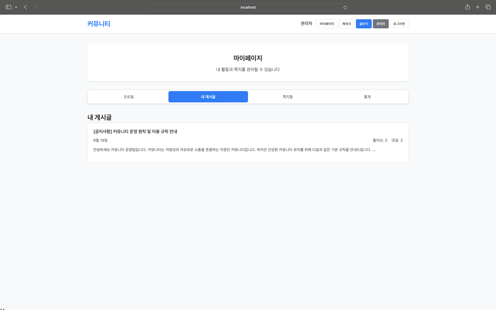 | 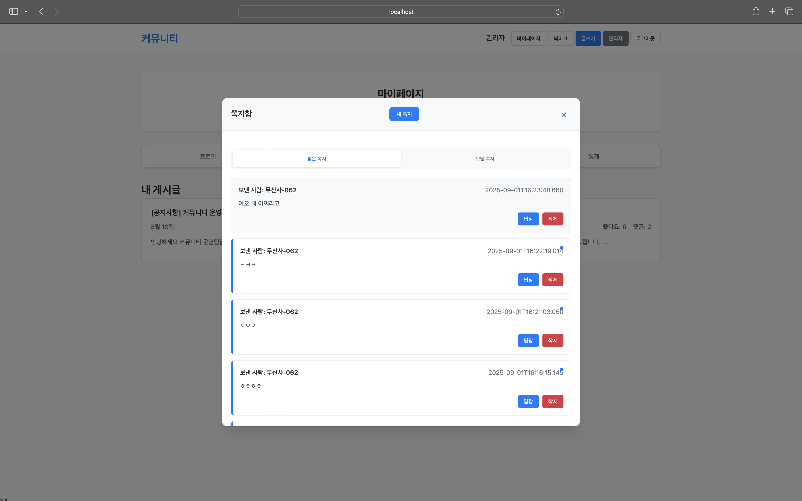 |

| 보낸 쪽지 | 통계 |
|-----------|------|
| 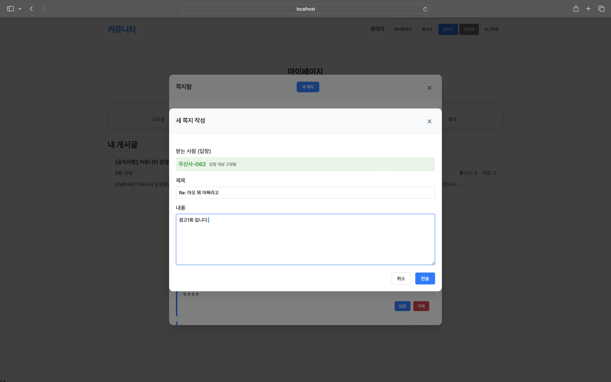 | 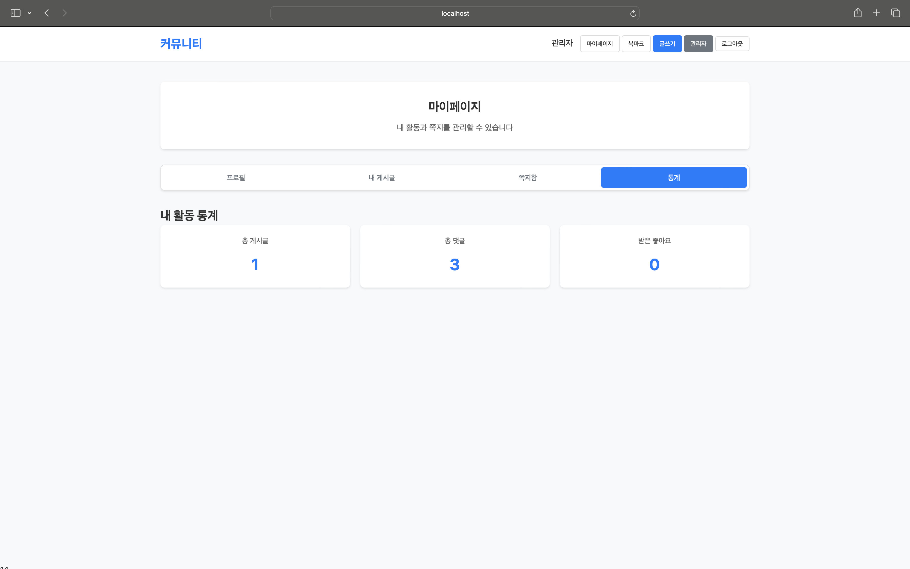 |

### 관리자 페이지
| 게시글 관리 |
|-------------|
| 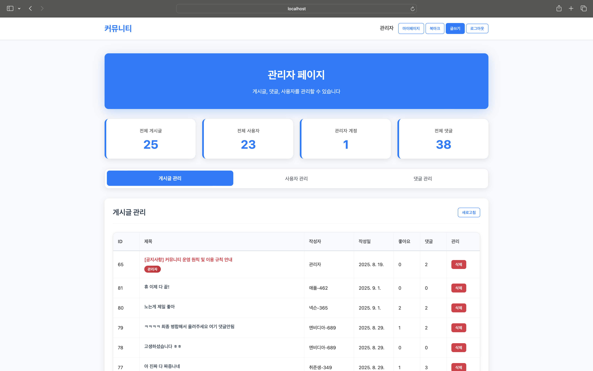 |

---

## 🛠️ 주요 기능 & 코드 예시

### 1. 회원가입 & 로그인
- 회사명 + 랜덤 숫자 3자리 → 닉네임 자동 생성  
- 로그인 시 권한(일반/관리자)에 따라 접근 페이지 구분  

```java
@PostMapping("/register")
public ResponseEntity<User> register(@RequestBody User user) {
    return ResponseEntity.ok(userService.register(user));
}
```

---

### 2. 게시판
- 글 작성/조회/삭제/상세보기  
- 관리자 권한으로 전체 글 관리 가능  
- 이미지 첨부 기능 지원  

```java
@PostMapping("/posts")
public ResponseEntity<Post> createPost(@RequestBody Post post) {
    return ResponseEntity.ok(postService.createPost(post));
}
```

---

### 3. 댓글 & 대댓글
- 댓글 작성, 수정, 삭제  
- 대댓글 구조 (parent_id로 연결)  

```java
@PostMapping("/posts/{postId}/comments")
public ResponseEntity<Comment> addComment(
        @PathVariable Long postId, @RequestBody Comment comment) {
    return ResponseEntity.ok(commentService.addComment(postId, comment));
}
```

---

### 4. 좋아요
- 게시글/댓글 좋아요 토글 방식  
- `(USER_ID, POST_ID)` Unique 제약으로 중복 방지  

```java
@PostMapping("/posts/{postId}/like")
public ResponseEntity<Void> toggleLike(
        @PathVariable Long postId, @RequestParam Long userId) {
    likeService.toggleLike(postId, userId);
    return ResponseEntity.ok().build();
}
```

---

### 5. 쪽지 (DM)
- 사용자 간 1:1 쪽지 송수신  
- 읽음 여부, 삭제 상태 관리  

```java
@PostMapping("/messages")
public ResponseEntity<Message> sendMessage(@RequestBody Message message) {
    return ResponseEntity.ok(messageService.sendMessage(message));
}
```

---

### 6. 북마크
- 게시글 북마크 저장 → 마이페이지에서 확인  

```java
@PostMapping("/posts/{postId}/bookmark")
public ResponseEntity<Void> addBookmark(@PathVariable Long postId, @RequestParam Long userId) {
    bookmarkService.addBookmark(userId, postId);
    return ResponseEntity.ok().build();
}
```

---

### 7. 관리자 페이지
- 회원, 게시글, 댓글 관리  
- 통계 대시보드 제공  

```java
@GetMapping("/admin/users")
public ResponseEntity<List<User>> getAllUsers() {
    return ResponseEntity.ok(adminService.getAllUsers());
}
```

---

## ⚡ 실행 방법

### 1. 프로젝트 클론
```bash
git clone https://github.com/dakyumlee/community.git
cd community
```

### 2. DB 설정 (Oracle)
1. Oracle DB 실행  
2. schema.sql 실행 후 테이블 생성  
3. application.yml에 DB 접속 정보 입력  

```yaml
spring:
  datasource:
    url: jdbc:oracle:thin:@localhost:1521/XE
    username: community
    password: password
  mybatis:
    mapper-locations: classpath:/mapper/**/*.xml
```

### 3. 빌드 및 실행
```bash
./gradlew build
java -jar build/libs/community-0.0.1-SNAPSHOT.jar
```

### 4. 접속 경로
- 사용자: http://localhost:8080  
- 관리자: role=ADMIN 계정으로 로그인 시 접근  

---

## 👥 팀원 역할 분담
- **이다겸 (팀장)**: 회원가입/로그인, 게시판, 검색, 마이페이지, 관리자, DB 설계, 북마크 기능  
- 윤호준: 쪽지 송/수신 기능 in mypage, in post ...(스파르타 코딩노예)
- 김근수: 좋아요 기능 +**든든한 발표자!**
- 최수인: 댓글/대댓글, PPT의 마법사🧙🏻‍♀️
- 권영승: 스토리 작가

---

## 📝 향후 개선점
- 비밀번호 평문 저장 → 해시 암호화 적용 예정  
- 검색 성능 향상 위해 ElasticSearch 도입 고려  
- 실시간 알림(WebSocket) 기능 추가  
- 모바일 반응형 UI 적용  

---

## 📌 개발 동기
단순 프로젝트를 넘어서, 실제 직장인들이 활용할 수 있는 **자유로운 커뮤니케이션 플랫폼**을 만들어보고자 했습니다.  
특히 **익명성 보장**과 **관리자의 통합 관리 기능**을 강조하여, 공정하고 자유로운 소통을 경험할 수 있는 커뮤니티를 구축했습니다.
